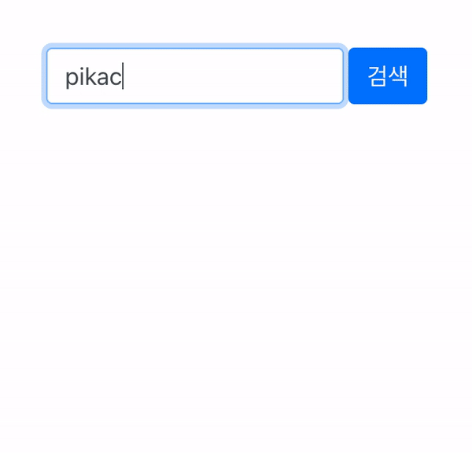

# 타입스크립트 연습 - 포켓몬 프로젝트 

#
> 💻 프로젝트 소개
------------
#### Typescript 기반의 포켓몬 검색 서비스
#
> 💻 Programming Language
------------
#### TypeScript, React, Redux, Redux-Thunk
#
> 💻 IDE
------------
#### Visual Studio Code   
#
> 💻 Data
------------  
#### API: https://pokeapi.co/
#
